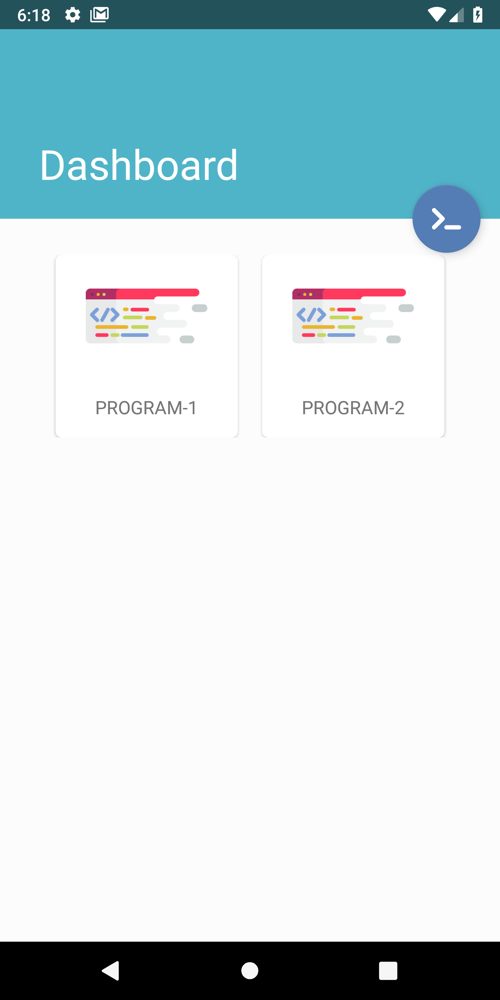
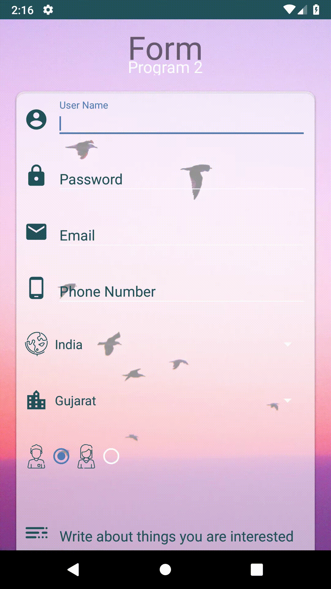
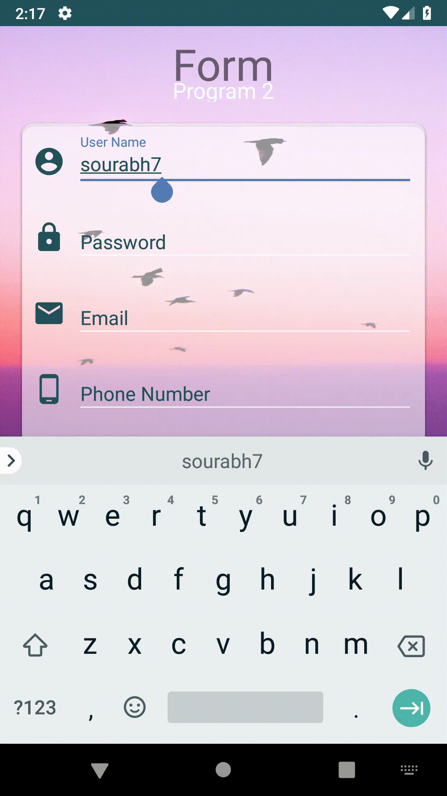
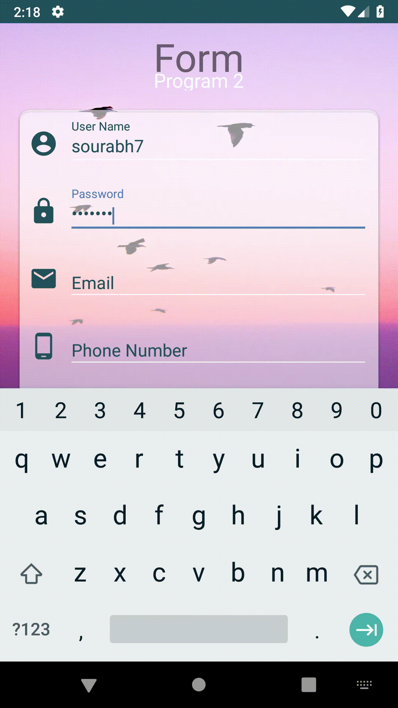
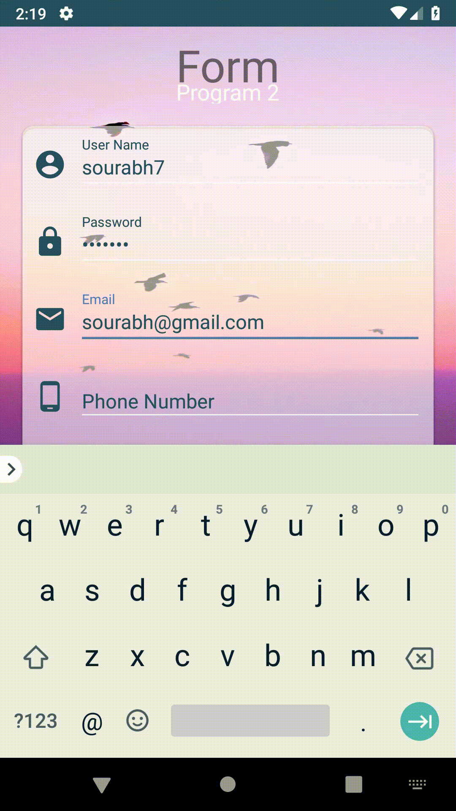
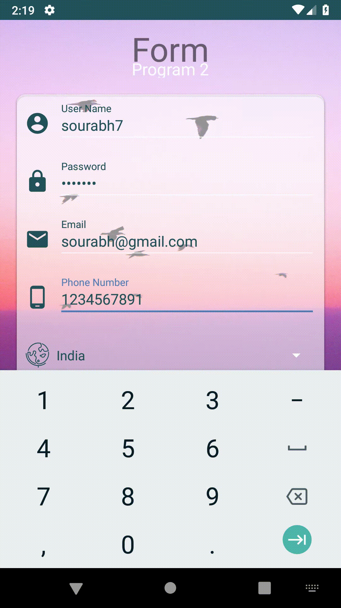
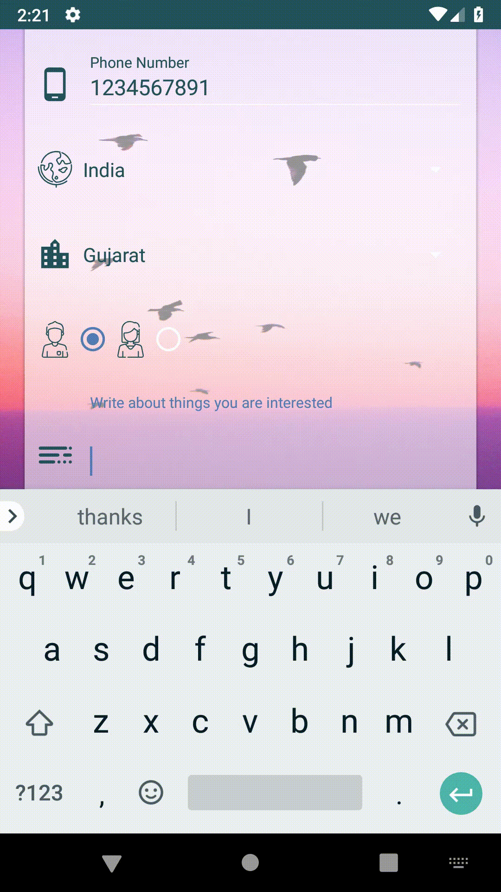

# This are the Android program's which are developed by me [sourabh karmakar] during my android lab sestion's, if you find it interesting leave a <3

## what will you find here.
### different kind of basic android program for getting started with android.

- PROGRAM-1   
Develop an android app which displays “Hello, welcome to Android Lab” Toast message
when user click on button.   
- PROGRAM-2 
Develop an android app which displays a form to get following information from user. 
Username 
Password 
Email Address 
Phone Number 
Country 
State 
Gender 
Interests 
Birth Date 
Birth Time 
Form should be followed by a Button with label “Submit”. When user clicks the button, a
message should be displayed to user describing the information entered.   

# Screenshots

# GIFs

This Thank you gif you will find in the link below and also get other's
<a href="https://gph.is/2lDKqsX">Thank you - GIPHY</a>
